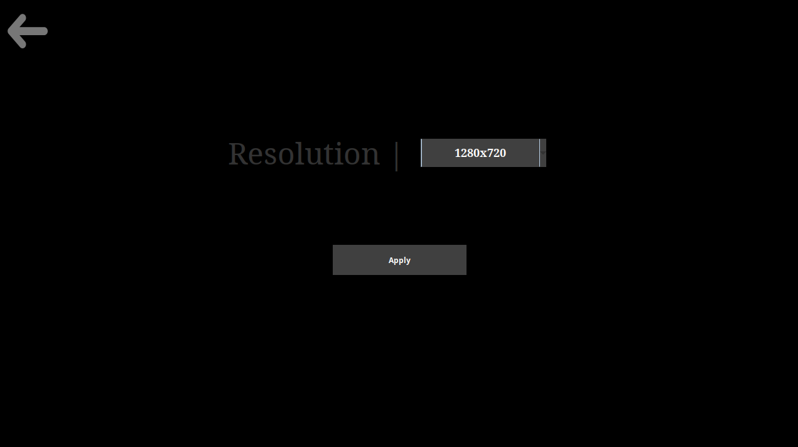

# Introduction

Hello! My name is Everett Sotelo and I am a professional software engineer with about 10 years experience. Over the years I had become complacent with my job and my Java skills became exceedingly rusty (I mostly develop in python now). So I decided to test my java knowledge and skills and recreate the beloved Brick Breaker game.

I think my effort here is solid but I can obviously see areas where I need to go back and improve, so don't expect this codebase to be perfect. I have accrued enough technical debt on the side and am very well aware of some of the issues or opportunities to refactor that this codebase has. However, this was a small project to test my abilities so that I can reflect on my Java when I had not touched the language in about 7 years. Therefore, I will leave this as is and move on to something else. Enjoy!

## Features

1. Main Menu
    * User is able to navigate a standard main menu. This includes, clicking a button to play the game, clicking a button to go to the settings menu, and clicking a button to exit the game

2. Settings Menu
    * User is able to change between 3 different resolutions. I chose a standard resolution of 1280x720, but also included the more common resolution option of 1920x1080. My personal monitor is a 2560x1440 so I included that as well for fun

3. Game 
    * Scoring system (max score 3000)
    * Death/Game Over System (3 lives per game)
    * Pausing system
    * Game Clear logic

# Extra Details

My implementation of the game attempts at creating a standard MVC architectural pattern. 

### Model

Contains the POJOs of the following game objects 

1. Ball 
2. Brick
3. Paddle
4. Screen

Additionally contains enums of 

1. Game State
2. Panel View

### View

Contains the various views of the game. 

1. Singleton GameFrame
2. Main Menu View
3. Settings View
4. Game View
5. Pause View
6. Brick Grid Generation
7. In Game Overlays

### Controller

The controller will have the main entry point of the application (should probably move it out lol) as well as the logic for each of the game objects which includes

1. Game Loop
2. Ball
3. Paddle
4. Brick

### Credits

The following music and sound was used in this project

1. **Main Menu Theme**
    * Song: Kirby's Block Ball - Stage 1 (KDL3 Remix)
    * Author: Pinci
    * [source](https://www.smwcentral.net/?p=section&a=details&id=8818)
2. **Game Theme**
    * Song: Castlevania Adventure - Battle of the Holy
    * Author: Wakana, Izuna
    * [source](https://www.smwcentral.net/?p=section&a=details&id=10918)
3. **Game Over Theme**
    * Song: Mega Man & Bass - Game Over
    * Author: Ultima
    * [source](https://www.smwcentral.net/?p=section&a=details&id=25803)
4. **Game Clear SFX**
    * Audio: Sonic 3 & Knuckles - Act Clear
    * Author: AntiDuck
    * [source](https://www.smwcentral.net/?p=section&a=details&id=15189)
5. **Bounce SFX**
    * Audio:  Bounce YoFrankie
    * Author: Lamoot
    * [source](https://opengameart.org/content/funny-comic-cartoon-bounce-sound)
    * [License: CC BY 3.0](https://creativecommons.org/licenses/by/3.0/)
6. **Brick Break SFX**
    * Audio: Hit Rock 01
    * Author: u_xjrmmgxfru
    * [source](https://pixabay.com/sound-effects/film-special-effects-hit-rock-01-266301/)
7. **Death SFX**
    * Audio: Game Over Arcade
    * Author: myfox14 (Freesound)
    * [source](https://pixabay.com/sound-effects/film-special-effects-game-over-arcade-6435/)
8. **Select SFX**
    * Audio: Select
    * Author: Abran331
    * [source](https://www.101soundboards.com/sounds/29960814-select)
